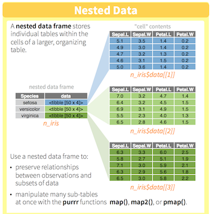
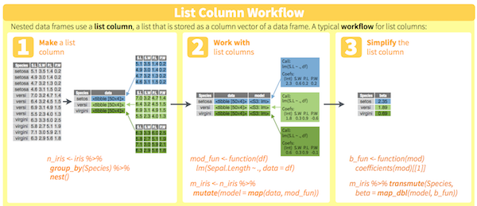
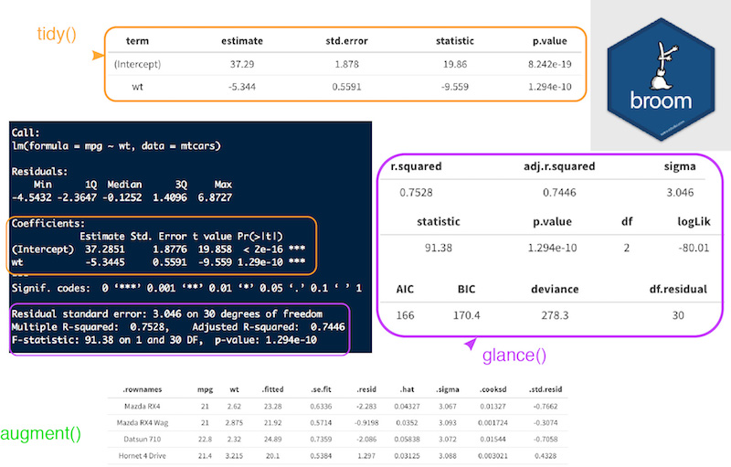
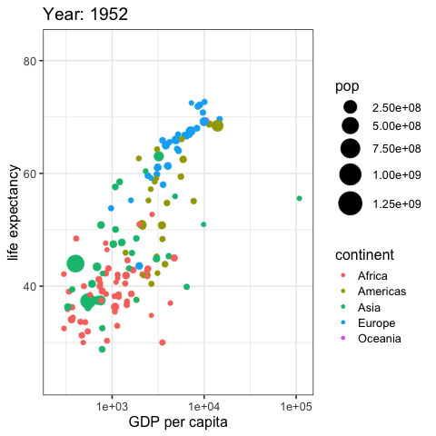

```{r setup, include = FALSE}
library(tidyverse)
ggplot2::theme_set(ggplot2::theme_bw(14))
```


## Learning objectives {.vs2}

### You will learn to: {.box-10 .offset-1 .intro .outline .icon-small}


- use `dplyr` / `purrr` for efficient data manipulation
- tidying multiple linear models using `broom` 
- managing related things together in **one** `tibble`
- summarise findings in one `gglot` using relevant aesthetics

### guided practical {.box-8 .offset-2 .practical .icon-small}


interactive session

## Managing multiple models {.center-img .vs3}

Tutorial based on the great conference by [Hadley Wickham][1]


[1]:https://www.youtube.com/watch?v=rz3_FDVt9eg


## list-column cheatsheet | reminder {.vs1}

### `nest()` {.intro .outline .box-6 .offset-3 .center-img}



%end%

see [pdf on rstudio' github repository](https://github.com/rstudio/cheatsheets/blob/master/source/pdfs/list-columns-cheatsheet.pdf)

## list-column cheatsheet | reminder {.vs1}

### workflow {.intro .outline .offset-2 .box-8 .middle .center-img}



%end%

see [pdf on rstudio' github repository](https://github.com/rstudio/cheatsheets/blob/master/source/pdfs/list-columns-cheatsheet.pdf)

## Gapminder | [gapminder](http://www.gapminder.org/) is a fact tank

### dataset {.box-8 .offset-2 .intro .outline .icon} 


- from an independent Swedish foundation
- [R package](https://github.com/jennybc/gapminder) by [Jenny Bryan!](https://github.com/jennybc)
- install from CRAN: `gapminder`

### Hans Rosling {.box-8 .offset-2 .intro .outline .icon}


- died one year ago
- fundamentaly optimistic
- great [talk](https://www.ted.com/talks/hans_rosling_shows_the_best_stats_you_ve_ever_seen)


## Guided practical | explore gapminder {.slide-practical .vs3}

###  {.box-8 .offset-2 .practical .outline .icon}


- install the `gapminder` package
- load `gapminder` and `tidyverse`
- **plot** the `life expectency` ~ `year`
- use `geom_line()`

###  warning! {.box-4 .offset-4 .warning .icon}


- mind the grouping! 

## Gapminder

```{r gap_first, eval = FALSE,  width = 8, class = "offset-2", title = "global vs individual trend"}
library(gapminder)
gapminder %>%
  ggplot(aes(x = year, y = lifeExp, group = country)) +
  geom_line()
```

### {.box-8 .offset-2 .practical .outline}

```{r gap_first, echo = FALSE, width = 8, class = "offset-2"}
```

## Keep related things together using list-column {.slide-practical .vs3}

###  {.box-8 .offset-2 .advice .outline .icon-small}


- add a column named `year1950` which is `year` - 1950
- **nest** the `tibble` by country, add the continent
- how many rows will you get?
- save the object as `by_country`

## Keep related things together | `nest()` {.vs1}

### nest _per_ country {.box-6 .code .outline}

```{r}
by_country <- gapminder %>%
  mutate(year1950 = year - 1950) %>%
  group_by(continent, country) %>%
  nest()
by_country
```

### helpers {.box-6 .middle .advice .outline}

- `year1950` will help to get count oldest date
- add `continent` to `group_by()` to keep the column along the `country`


## One country example | Germany {.vs1 .build}

### from original tibble {.box-6 .practical .stretch .compact-output}

```{r}
gapminder %>%
  filter(country == "Germany") %>%
  select(-country, -continent)
```

### nested tibble {.box-6 .practical .compact-output}
```{r}
by_country %>%
  filter(country == "Germany")
by_country %>%
  filter(country == "Germany") %>%
  pull(data)
```

## What happens in the DATA FRAME, stays in the data frame {.vs2 .center-img}

```{css, echo = FALSE}
.vembedr {
  border-radius: 25px; /* adjust it to your needs */
  overflow: hidden;
}

.vembedr iframe {
  display: block;
  border: none;
}
```


```{r, echo = FALSE}
vembedr::embed_youtube("4MfUCX_KpdE") %>%
  vembedr::use_start_time("15m43s") %>%
  htmltools::div(class = "vembedr")
```


## Las Vegas principle, add linear models {.slide-practical .vs3}

###  {.box-8 .offset-2 .advice .outline .icon-small}


- using `by_country`
- add a new column `model` with linear regressions of **LifeExp** on **year1950**
- save as `by_country_lm`

### ask yourself {.box-8 .offset-2 .warning .icon-small}


- if you see **add column**, do you use `mutate` or `summarise`?
- dealing with a list-column (here the column `data`), do you need to use `map`?

## Keep related things together | linear models {.vs2}

### Linear model _per_ country {.box-12 .practical}
```{r}
by_country_lm <- by_country %>%
  mutate(model = map(data, ~ lm(lifeExp ~ year1950, data = .x)))
by_country_lm
```


## Explore nested tibble {.slide-practical .vs3}

###  {.box-10 .offset-1 .advice .outline .icon-small}


- count # rows per country using the `data` column
- plot `lifeExp` ~ `year1950` for **Rwanda** by unnesting `data`
- display the `summary` for the linear model of **Rwanda**
- how do you interpret the $r^2$ for this particular model?

### reminder {.box-8 .offset-2 .warning .outline}

- **list column** is a list
- to extract the `x`th element, use the `pluck("model", x)` `purrr` syntax

## Explore nested tibble {.build}

### `lifeExp` & `year1950` for Rwanda {.box-5 .practical .stretch .show}

```{r, class = "compact-output"}
by_country_lm %>%
  filter(country == "Rwanda") %>%
  unnest(data) %>%
  select(lifeExp, year1950)
```
```{r, include = FALSE}
by_country_lm %>% 
  mutate(n_nest = map_int(data, nrow))
```


### lm for Rwanda {.box-7 .practical}

```{r, class = "compact-output"}
by_country_lm %>%
  filter(country == "Rwanda") %>%
  pluck("model", 1) %>%
  summary()
```

### {.box-8 .offset-2 .warning}

$r^2$ is close to 0, linearity sounds broken

## broom cleanup {.center-img}




## Tidying models | extract from nested lists {.slide-practical .vs2}

###  {.box-10 .offset-1 .advice .outline .icon-small}


- using `by_country_lm`, add 4 new columns
    + `glance`, using the broom function on the `model` column
    + `tidy`, using the broom function on the `model` column
    + `augment`, using the broom function on the `model` column
    + `rsq` from the `glance` column
- save as `models`
- why extracting the $r^2$ in the main tibble?

### reminder {.box-10 .offset-1 .warning .outline}

- use `map` when dealing with a list column 
- in `map`, shortcut with quotes (like `"r.squared"`) extract the specifed variable
- remenber, `map` takes and returns a **list**. Use `map_dbl()` to coerce output to **doubles**

## Tidying models | extract from nested lists {.vs1}

### useful info {.box-3 .intro .outline}

- coefficients estimates:
    + **slope**
    + **intercept**
- $r^2$ 
- residuals

%end%

```{r, class = "compact-output", width = 9}
library(broom)
models <- by_country_lm %>%
  mutate(glance  = map(model, glance),
         tidy    = map(model, tidy),
         augment = map(model, augment),
         rsq     = map_dbl(glance, "r.squared"))
models
```


### extracting $r^2$ in main tibble {.box-8 .offset-2 .advice .outline}

- no need to unnest for sort / filtering.

# Exploratory plots

## plotting r square for countries{.slide-practical .vs3}

###  {.box-10 .offset-1 .advice .outline .icon-small}


- plot `country` ~ `r.square` 
- **reorder** country levels by `r.square`: _snake plot_
- color points per continent
- which continent shows most of the low $r^2$ values?

### reminder {.box-8 .offset-2 .warning .outline}

to reorder discrete values:

- must be `factor`
- use the `forcats` package
- use the `fct_reorder()` to reorder with a continuous variable

## Do linear models fit all countries? | snake plot {.nvs1}

```{r, row = c(6, 6), fig.height = 5, fig.width = 5}
library(forcats)
models %>%
  ggplot(aes(x = rsq, 
             y = fct_reorder(country,
                             rsq))) +
  geom_point(aes(colour = continent), 
             alpha = 0.5) +
  theme_classic(18) +
  theme(axis.text.y = element_blank(),
        axis.ticks.y = element_blank(),
        legend.position = c(0.25, 0.75)) +
   guides(color = guide_legend(
     override.aes = list(alpha = 1))) +
  labs(x = "r square",
       y = "Country") 
```


## display the real data for countries with a low rsquare value {.slide-practical .vs3}

###  {.box-10 .offset-1 .advice .outline .icon-small}


- focus on non-linear trends
- filter the 20 countries with the lowest $r^2$ 
- `unnest` column `data`
- plot `lifeExp` ~ `year` with lines
- colour per continent
- facet per country
- same questions for the **top 20** $r^2$

## Exploratory plots | focus on non-linear trends {.nvs1}

```{r, row = c(6, 6), fig.height = 6, fig.width = 6}
models %>%
  top_n(20, desc(rsq)) %>%
  unnest(data) %>%
  ggplot(aes(x = year, y = lifeExp)) +
  geom_line(aes(colour = continent)) +
  facet_wrap(~ country) +
  theme(axis.text.x = element_text(angle = 45,
                                   hjust = 1),
        legend.position = "bottom")
```


## interpreting the linear model {.build}


### regression {.box-6 .intro .outline .show}

- what represents the **intercept**?
    + using `year1950`?
    + using `year`?
    + justify Hadley choice
- what represents the **slope**?

### {.col-6 .show}

```{r, echo = FALSE, fig.height = 4}
models %>%
  filter(country == "Germany") %>%
  unnest(data) %>%
  ggplot(aes(year1950, lifeExp)) +
  geom_line() + labs(title = "Germany")
```

%end%

```{r, width = 6, title = "Germany, lifeExp ~ year1950", class = "show"}
filter(models, country == "Germany") %>%
  unnest(tidy) %>%
  select(rsq:estimate)
```

```{r, echo = FALSE, width = 6, title = "Germany, lifeExp ~ year", class = "stretch"}
gapminder %>%
  filter(country == "Germany") %>%
  lm(lifeExp ~ year, data = .) -> lm_ger
tidy(lm_ger) %>% 
  bind_cols(tibble(rsq = rep(glance(lm_ger)$r.squared, 2))) %>%
  select(rsq, term:estimate)
```


## Summarise on one plot | by Hadley Wickham {.slide-practical .vs2}

### {.box-10 .offset-1 .advice .outline .icon-small}


- unnest coefficients (`tidy` column)
    + mind to keep the `continent`, `country` and `rsq` columns
- put intercept and slope in their own columns
    + in **wide** format, only one value can be used. Discard unused columns regarding term statistics. 
- plot slope ~ intercept (watch out the `(Intercapt)` name which needs to be between backsticks '`')
- colour per continent
- size per $r^2$ (use for `scale_size_area()` for lisibility)
- add tendency with `geom_smooth(method = "loess")`

## All in all | by Hadley Wickham {.nvs1}

```{r all_in_all, eval = FALSE, width = 10, class = "offset-1"}
models %>%
  unnest(tidy) %>%
  select(continent, country, rsq, term, estimate) %>%
  spread(term, estimate) %>%
  ggplot(aes(x = `(Intercept)`, y = year1950)) +
  geom_point(aes(colour = continent, size = rsq)) +
  geom_smooth(se = FALSE, method = "loess") +
  scale_size_area() + labs(x = "Life expectancy (1950)", y = "Yearly improvement")
```

### {.box-8 .offset-2 .practical .outline}

```{r all_in_all, echo = FALSE, fig.height = 4}
```

## animation made easy {.vs2}

```{r, eval = FALSE, title = "[gganimate](https://github.com/thomasp85/gganimate) by Thomas Pedersen", width = 5}
library(gganimate)
gapminder %>%
  ggplot(aes(x = gdpPercap,
             y = lifeExp,
             size = pop, 
             color = continent)) +
  transition_time(year) +
  ease_aes("linear") +
  scale_size(range = c(2, 12)) +
  geom_point() +
  theme_bw(16) +
  labs(title = "Year: {frame_time}", 
       x = "GDP per capita", 
       y = "life expectancy") +
  scale_x_log10() -> p
animate(p)
anim_save("img/11/gapminder2.gif")
```

### {.col-7}




## Before we stop {.vs1}

### You learned to: {.box-8 .offset-2 .intro .icon}


- keep related things together:
    + input data
    + meaningful grouping ids 
    + perform modelling
    + extract relevant model components
    + explore visually your findings


### R workshop @Beval {.box-10 .offset-1 .intro .outline .icon-small}

- _Data processing with R tidyverse_ in **May 2019**: Tuesday 14th - Friday 17th
- **no** fees
- **2 ECTS** for the PhD students who attend the workshop and complete a short project.


